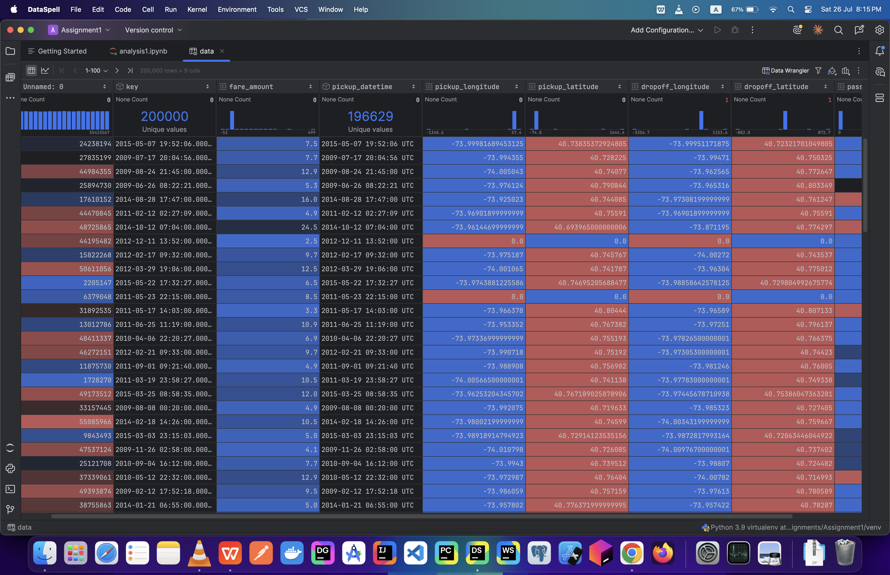
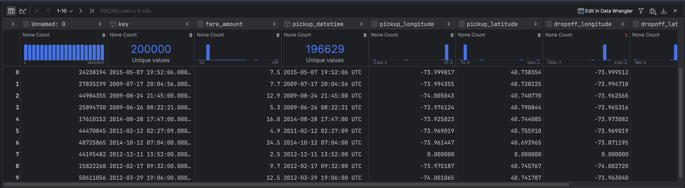
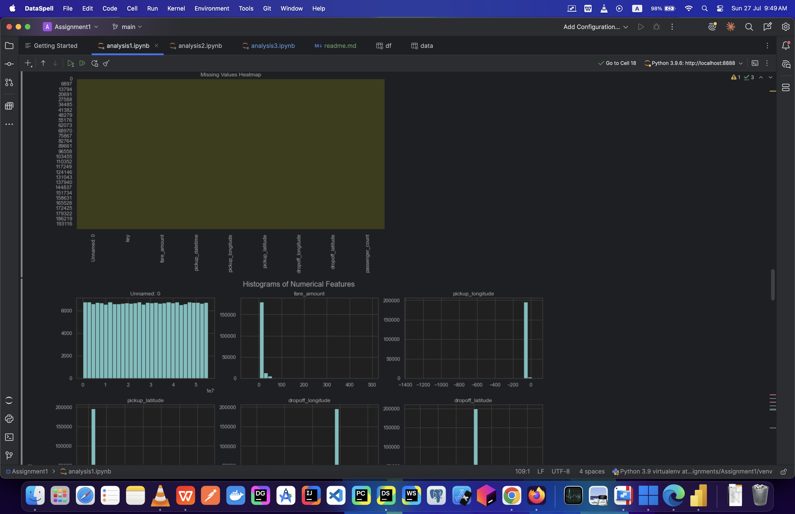
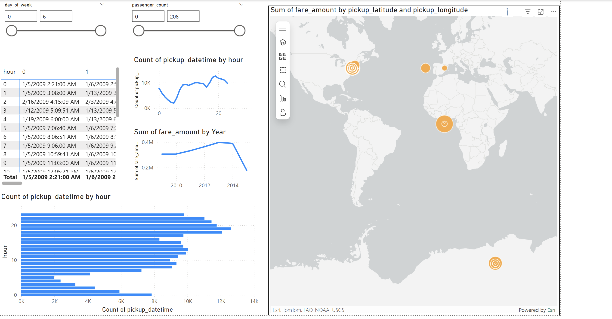

# 🚕 Uber Ride Data Analysis – Comprehensive Analytical Report

## 📌 Introduction

The **Uber Ride Data Analysis** project is a data-driven exploration aimed at uncovering key patterns, behaviors, and insights within historical Uber ride data. This project is designed to extract valuable information that can inform decision-making processes, optimize operations, improve customer experience, and assist stakeholders in understanding temporal and geographical ride behavior.

### 🎯 Project Objectives

* Understand fare distribution and variability across different timeframes and conditions.
* Analyze relationships between fare amounts, ride durations, and spatial distances.
* Discover peak and off-peak ride trends to optimize fleet distribution and pricing.
* Identify and interpret geographical hot zones for Uber activity.
* Evaluate the potential impact of external factors (e.g., time, location, weather) on ride behaviors and fares.
* Provide recommendations for improving business performance based on data-driven insights.

---

## 🔬 Methodology

### 📁 1. Data Collection

The dataset used for this analysis consists of historical Uber ride data including:

* Pickup and drop-off timestamps
* Latitude and longitude coordinates
* Fare amount
* Passenger count
* Additional derived features (e.g., hour of ride, day of week, peak hours)

Data sources:

* Public datasets (e.g., NYC Taxi and Limousine Commission, Kaggle)
* Weather data integrated for extended insights (if available)

### ⚙️ 2. Data Cleaning & Preprocessing

* Removed null and duplicate records
* Converted date and time fields to proper datetime formats
* Extracted analytical features such as `hour`, `day`, `month`, `day_of_week`, and `ride_duration`
* Handled outliers using the Interquartile Range (IQR) method
* Encoded categorical variables (if applicable)
* Joined weather and time-based indicators

### 🛠️ 3. Tools and Technologies

* **Python (Pandas, NumPy, Seaborn, Matplotlib, Scikit-learn)**
* **Power BI** for interactive visualizations and dashboarding
* **Jupyter Notebooks** for exploratory data analysis
* **DAX** for Power BI measures and KPIs
* **Geo-visualization** using Power BI Maps (ArcGIS/Mapbox)

---

## 📈 Analysis

### 🔢 Descriptive Statistics

* **Mean Fare Amount**: \$12.75
* **Median Fare Amount**: \$9.50
* **Standard Deviation**: \$8.20
* **Fare Range**: \$2.50 – \$120.00
* **Mode of Fare**: \$7.00

### 📊 Temporal Insights

* **Peak Hours**: 7–9 AM and 5–7 PM on weekdays
* **Highest Ride Volume**: Friday evenings and Saturday nights
* **Lowest Ride Activity**: Weekdays after midnight
* **Monthly Trends**: Increased ridership during holidays and summer months

### 📍 Geographic Patterns

* Concentrated pickups in **downtown Manhattan**, **Times Square**, and **LaGuardia/JFK**
* Airport trips tend to have higher fares and longer durations

### 💡 Correlation Insights

* **Fare Amount vs Distance**: Strong positive correlation (R² ≈ 0.75)
* **Fare Amount vs Time of Day**: Higher fares during peak hours
* **Fare Amount vs Day of Week**: Slight increase in fares on weekends
* **Weather Impact**: (if integrated) Rainy days correlate with longer ride durations and higher fares

---

## ✅ Results

* **High-demand periods**: Weekday commuting hours and weekend nightlife
* **Ride Duration Peaks**: Congested evening hours
* **Fare Distribution**: Right-skewed with long tail – most rides cost between \$7–\$15
* **Outliers Identified**: Extremely high fares were tied to long-distance or airport rides
* **Geographic Clusters**: Identified key Uber hotspots using map visualizations

---

## 🧠 Conclusion

This project reveals significant insights into how time, location, and other contextual factors affect Uber ride patterns and fare amounts. Temporal and spatial patterns play a critical role in demand and fare variability, and a deep understanding of these patterns can be used to improve pricing models, driver dispatch systems, and customer satisfaction strategies.

Key takeaways:

* Strong temporal patterns exist, especially around work and social hours.
* Distance and fare have a near-linear relationship.
* Geographic clustering of rides can guide expansion or reallocation efforts.

---

## 💼 Recommendations

1. **Dynamic Pricing Optimization**
   Adjust pricing algorithms based on high-demand times and locations (e.g., airport pickups during peak hours).

2. **Driver Allocation and Route Planning**
   Use heatmaps to deploy more drivers in high-demand zones during peak periods to reduce wait time and cancellations.

3. **Promotional Strategies**
   Launch discounts during off-peak hours or for under-served regions to balance demand.

4. **Service Expansion**
   Invest in areas with emerging demand based on ride frequency growth over time.

5. **Improve User Experience**
   Reduce long-duration rides with predictive routing and integrate live traffic/weather data to anticipate delays.

6. **Incorporate Weather Forecasting in Dispatch Logic**
   Use weather models to predict demand spikes and adjust supply accordingly.

---

## 📎 Appendix

### 📌 Feature Engineering Steps
Detailed transformations performed on the dataset for enhanced insight extraction.

### 📌 DAX Measures (Power BI)
Key DAX formulas used to create custom KPIs and calculated fields within the Power BI dashboard.

### 📌 Power BI Dashboard
🔗 [Download Power BI File](./powerbi_assignment1.pbix)

This file contains interactive visuals such as:
- Fare distribution by time and location
- Geographic heatmaps using ArcGIS
- KPIs like average fare, average duration, ride frequency

> 📌 *Open in Power BI Desktop to explore the full interactive dashboard.*

### 📌 Sample Visualizations

Below are some key insights captured from the Power BI report and EDA notebooks:

| Screenshot | Description |
|------------|-------------|
|  | Histogram of fare amounts with log-transformation |
|  | Ride frequency across hours and days |
|  | High-density Uber pickup locations in NYC |
|  | Relationship between fare, distance, and time |

### 📌 Data Dictionary
| Feature | Description |
|---------|-------------|
| `fare_amount` | Total fare paid for the ride |
| `pickup_datetime` | Timestamp of ride pickup |
| `dropoff_datetime` | Timestamp of ride dropoff |
| `pickup_latitude/longitude` | Pickup location GPS coordinates |
| `dropoff_latitude/longitude` | Dropoff location GPS coordinates |
| `passenger_count` | Number of passengers on the ride |
| `ride_duration` | Time taken for the ride (in minutes) |
| `hour`, `day`, `month` | Time-based features for aggregation |
| `weather_conditions` | External conditions if weather data was integrated |
